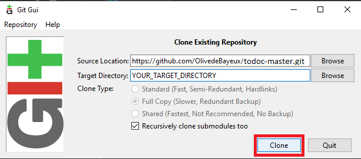

# todoc-master
Project_5
# OpenClassrooms

Ce dépôt contient une mini-application pour le P5 du parcours **Grande École du Numérique**.
Délivrez une application mobile en production

**IMPORTATION DU PROJET**

**GITHUB:**
Télécharger le projet sur votre ordinateur en cliquant sur le bouton vert "download".
Racine du projet: https://github.com/OlivedeBayeux/todoc-master.git
Puis "Download ZIP".

**GIT:**
Cloner le repo depuis git: https://github.com/OlivedeBayeux/todoc-master.git

**OUVERTURE DU PROJET:**
Ouvrir avec Android Studio --> File>Open --> YOUR_PROJECT.

**COMPILER LE PROJET:**
Cliquer sur le marteau vert pour compiler.

**CHOISIR UN DEVICE DE SORTIE**

**VIRTUAL DEVICE:**
Allez dans Tools --> Device manager

Créez un appareil virtuel suivant vos besoins.
Ici je me sers d'un smartphone virtuel appelé Niou Pixel.

Vous pouvez choisir ici un appareil virtuel ou un appareil physique connecté.

**TABLETTE OU TELEPHONE ANDROID:**
Avant de pouvoir installer vos apk sur votre téléphone ou votre tablette avec un cable USB, vous devez activer le mode "développeur"
Allez dans les Paramètres de votre téléphone.
Tapez sur À propos du téléphone.
Tapez 7 fois sur Numéro de Build pour activer le mode développeur.
Revenez dans Paramètres.
Tapez sur le menu Options développeurs qui vient de s’afficher.
Activez les options développeurs : autorisez les paramètres de développement en tapant sur OK.

**CHOISIR LE DEVICE POUR INSTALLER VOTRE APPLICATION:**

**EXECUTER LE PROJET:**
Cliquer sur la flèche verte pour l'exécuter.

